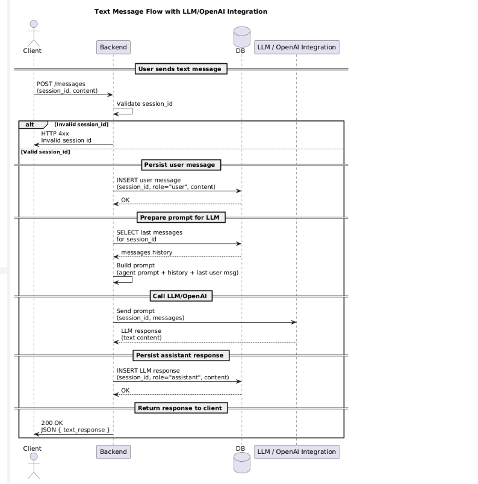
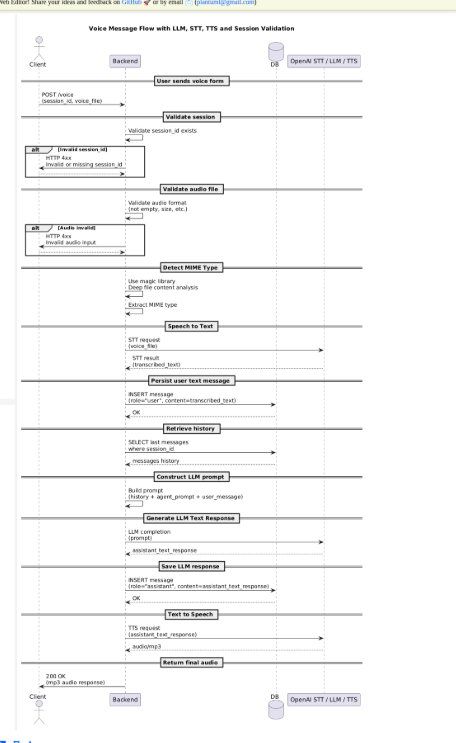
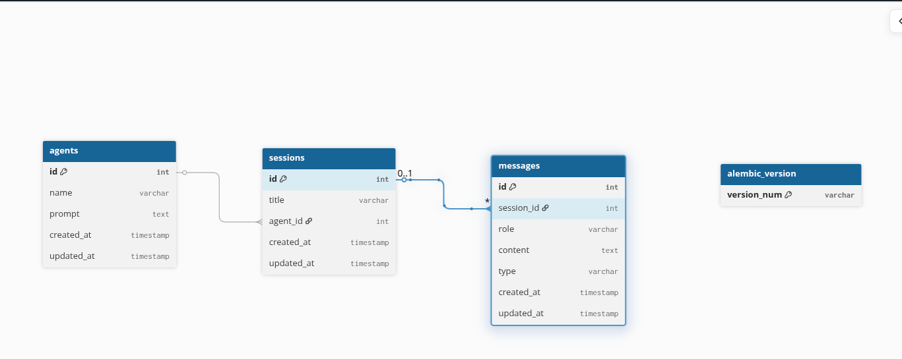

# AI-Agent-Platform
backend service for an AI Agent Platform, enabling users to create, manage, and interact with AI agents via text and voice. The platform will integrate with OpenAI APIs for chat, speech-to-text, and text-to-speech functionalities.

## Message Processing
- support Arabic and English messages 
- for audio messages it's support diffent range like wav, ogg , mp3 and other audio types 
### Text Message Processing 
1. Client Send Message
2. Backend validates `session` if not exists raise exception 
3. message saved in DB as user message
4. generate input to llm using last session message , agent prompt and sent message 
5. call Opn AI to get text response 
6. save response to db as assistant reply

### Voice Message Processing 

1. Client Send Message
2. Backend validates `session` if not exists raise exception 
3. validate parsed voice note is correct audio file otherwise return http exception 
4. extract mime type of audio, using magic for deep type inspection
5. Call Open AI to convert speech to text
6. message saved in DB as user message
7. generate input to llm using last session message , agent prompt and sent message 
8. call Opn AI to get text response 
9. save response to db as assistant reply
10. call LLM to convert text reply to Voice (STT) and return mp3 voice ready to play 

## Database & Migrations 

- `id` is `UUID7` type
- all tables must have `id`, `created_at` and `updated_at`
- useing `alembic` for manage db migrations and create versions of db schema changes 
- `alembic` is production grade tool for managing versions and supports `sqlalchemy` 
- `sqlalchemy` as ORM with `sqlite3` 
- all db queries runs `async`

## API Documentation 

- Swagger Documentation usnder ur   `/api/v1/docs`
- read docker under `/api/v1/redoc` 

## Postman Collection 

- Requests and response in different text case attached to postman collection 
- Postman Collection [Link](https://winter-desert-603042.postman.co/workspace/GitHub-~83d00952-4216-4e33-889c-2957a579fafc/collection/6749950-ec2abf67-fb15-4b2d-9b75-ba1fcb8a843c?action=share&creator=6749950)

## Urls & APIS 
### Agent
| URL                | Method | Description                         |
|--------------------|--------|-------------------------------------|
| `/api/v1/agent`    | POST   | Create New Agent                 |
| `/api/v1/agent/{agent_id}`       | GET   | Get Agent by ID |
| `/api/v1/agent`  | GET    | List of Agents  |
| `/api/v1/agent/{agent_id}`| PUT    |Update Agent data  |
| `/api/v1/agent/{agent_id}`| DELETE    |Delete Agent by ID  |

### Session
| URL                | Method | Description                         |
|--------------------|--------|-------------------------------------|
| `/api/v1/session`    | POST   | Create New Session                 |
| `/api/v1/session/{session_id}`       | GET   | Get Session by ID |
| `/api/v1/session`  | GET    | List of Session  |
| `/api/v1/session/{session_id}`| PUT    |Update session data  |
| `/api/v1/session/{agent_id}`| DELETE    |Delete session by ID  |

### Messages
| URL                | Method | Description                         |
|--------------------|--------|-------------------------------------|
| `/api/v1/message/text`    | POST   | send text message                 |
| `/api/v1/message/voice`   | POST   | send voice message |
| `/api/v1/message/conversion/{session_id}`  | GET    | List of all messages in session by user and assistant |

## ENV Variables 

| Name        | Description                                   |
|-------------|-----------------------------------------------|
| APP_VERSION | Version of app |
| ENV    | Enviroment name wether it `DEV` or `TEST` or `PRODUCTION`   |
| LOG_LEVEL     | The logging Level for application|
| DATABASE_URL | Database Connection Url|
| OPENAI_API_KEY | OPEN AI Key to use it's service  |

## APP Dockerization & Containerzation 

- multi stage `Dockerfile` included that dockerizing the 
- multi stages docker file help mimize the image size and achive optimization 
- `Docker Compose` file include to operate the fully app with `Backend` and `DB`

- Run Application Using Docker 
    - in root dir of app run `docker compose up --build`
    - will build images for `db` and `backend` and create networj between them 

## Libraries & Dependancies 

| Name        | Description                                   |
|-------------|-----------------------------------------------|
| poetry  | python package for manage projects and dependancies |
| Fastapi    | python backend framework |
| pydantic     | serialization and validation with type hints |
| uvicorn       | asgi application server    |
| python-magic | deep file content inspection|
| uuid-tools  | include UUID tools and UUID7 |
| Sqlalchemy  | Python orm libaray |
| Alembic  | Migration tool for sqlalchemy migrations changes|
|  aiosqlite | async sqlite3  |
|openai | openai client python library|

